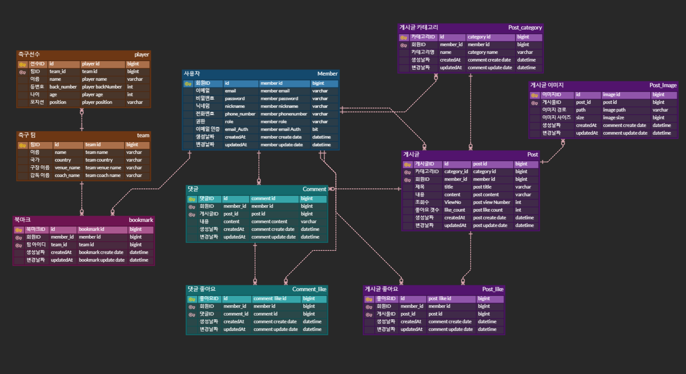

# ⚽ 축구 커뮤니티 AM-KOREA
축구 정보를 얻고 사용자들과 소통할 수 있는 커뮤니티 서비스 입니다.

## ⚙ Tech Stack
</a> 
</a> 
 </a>
 
</a>
</a>
</a>

## ERD

## 프로그램 기능 및 설계
### 회원관리
- 회원가입 기능
	- 사용자는 회원가입을 할 수 있다.
    - 이메일, 닉네임(10자 이내), 패스워드, 휴대폰번호를 입력받으며, 이메일은 unique 해야한다.
    - 이메일 인증의 경우 10분 이내에 수행해야한다.
    - 모든 사용자는 회원가입 시에 user 권한을 갖는다.
		- 관리자 권한(admin) 도 있지만, 관리자 회원가입은 별도의 API는 제공하지 않는다.

- 로그인 기능
	- 사용자는 로그인을 할 수 있다.
    - 로그인 시 회원가입 때 사용한 이메일과 패스워드가 일치해야한다.
    - 로그인 성공 시에 JWT 토큰을 발급한다(access Token, refresh Token)
    - access token 만료 시간은 30분, refresh token 만료 기간은 5일이다.
    - redis에 refresh token을 저장한다.

- 로그아웃 기능
	- redis에서 조회한 후에 존재한다면 refresh token을 삭제한다.
    - 로그아웃 시에 access token을 저장하여 Black List 처리한다.
		- 사용자가 로그아웃 처리한 token으로 요청이 올 경우 로그아웃 상태이면 인증 처리 거부한다.

- 회원정보 조회
	- access token 일치 여부를 확인 후에 정보를 조회한다.
    - `이메일`, `닉네임`, `휴대폰번호` 조회할 수 있다.

- 회원정보 수정
	- access token 일치 여부를 확인 후에 정보를 조회한다.
	- `닉네임`, `패스워드`, `휴대폰번호` 를 변경할 수 있다.

### 커뮤니티
- 게시글 작성 기능
	- 로그인한 사용자는 권한에 관계 없이 글을 작성할 수 있다.
	- 사용자는 `제목(텍스트)`, `게시글 내용(텍스트)`, `사진` 을 이용하여 게시할 수 있다.
	- 그림 이미지 파일은 `AWS S3` 에 저장하고 관리한다.
    - 게시글 내용은 최대 300자 이내로 작성한다.
 

- 게시글 목록 조회 기능
	- 로그인하지 않은 사용자를 포함한 모든 사용자는 게시글을 조회할 수 있다.
    - 게시글은 기본적으로 최신순으로 정렬되고, 조회수 및 좋아요 갯수로도 정렬이 가능하다.
    - 게시글이 많을 수 있기 때문에 paging 처리를 진행한다.

- 특정 게시글 조회 기능
	- 로그인하지 않은 사용자를 포함한 모든 사용자는 게시글을 조회할 수 있다.
    - 제목 or 내용을 검색해서 특정 게시물을 조회할 수 있다.
    - `게시글 제목`, `게시글 내용`, `작성자`, `작성일`, `좋아요 갯수` 이 조회된다.
    - 조회수는 `redis` 와 `scheduling` 를 이용하여 동일 게시물을 조회하면 카운팅이 되지 않는다.
        - 만약 세션이 만료된다면 카운트는 증가한다
  

- 게시글 좋아요 기능
	- 로그인한 사용자는 권한에 관계 없이 `좋아요`를 누를 수 있다.
    - 좋아요 기능 사용 시에는 `사용자`와 `게시글`의 정보를 가지고 중복 방지 한다.

- 게시글 카테고리 생성 기능 
	- 관리자 권한을 가진 사용자가 생성할 수 있다.

- 게시글 카테고리 변경 기능
	- 관리자 권한을 가진 사용자가 생성할 수 있다.

- 게시글 카테고리 조회 기능
	- 로그인하지 않은 사용자를 포함한 모든 사용자는 카테고리를 이용해서 게시글을 조회할 수 있다.
    - 카테고리와 연관된 특정 게시물을 조회할 수 있다.
	- `카테고리 이름`, `게시글` 이 조회된다.

- 댓글 작성 기능
	- 로그인한 사용자는 권한에 관계 없이 댓글을 작성할 수 있다.
	- 사용자는 `댓글 내용(텍스트)`를 작성할 수 있다.

- 댓글 수정 기능
	- 댓글을 작성한 작성자만 수정이 가능하다.

- 댓글 삭제 기능
	- 댓글을 작성한 작성자와 게시글의 작성자는 삭제가 가능하다.

- 댓글 목록 조회 기능
	- 로그인하지 않은 사용자를 포함한 모든 사용자는 댓글을 조회할 수 있다.
    - 댓글은 최신 순으로만 정렬되며, paging 처리를 한다.

- 댓글 좋아요 기능
	- 로그인한 사용자는 권한에 관계 없이 `좋아요`를 누를 수 있다.
	- 좋아요 기능 사용 시에는 `사용자`와 `댓글`의 정보를 가지고 중복 방지 한다.

### 축구 정보 

- 축구 관련 데이터 조회
	- [API-Football](https://apifootball.com/) 에서 데이터를 조회한다.

- 데이터 검색 기능
	- 로그인하지 않은 사용자를 포함한 모든 사용자는 검색이 가능하다.
    - `리그 아이디`의 경우에는 특정 유럽 5대 리그를 기준으로 `enum` 처리하여 검색의 번거로움을 줄인다.
    - 검색한 데이터는 DB에 저장하여 북마크 관련 데이터 사용 시에 활용한다.
  
    1. 축구 선수 검색
   	 	* `팀 아이디`, `선수 아이디` 을 검색해서 특정 선수의 정보를 조회할 수 있다.
        *  `선수 이름`, `선수나이`, `포지션`, `등번호` 이 조회된다.
	2. 축구 팀 검색
       * `팀 아이디` 을 검색해서 특정 팀 정보를 조회할 수 있다.
       * `팀 이름`, `국가`, `구장 이름`, `감독 이름` 이 조회된다.
    3. 득점 순위 검색
       * `리그 아이디` 를 검색하면 해당 리그의 `득점 순위 10위`까지 조회할 수 있다.
       * `순위`, `선수 이름`, `소속팀`, `골 갯수`, `도움 갯수` 이 조회된다.
    4. 팀 순위 검색
        * `리그아이디` 와 검색하고 싶은 `등수`를 조회하면 특정 팀의 순위와 정보를 조회할 수 있다.
        * `리그 순위`, `리그 이름`, `팀이름`, `승리`, `무승부`, `패배` 이 조회된다.

- 축구 팀 북마크 등록
	- 로그인한 사용자는 권한에 관계 없이 북마크를 등록할 수 있다.

- 축구 팀 북마크 목록 조회
    - 북마크는 등록한 순으로 정렬된다.
    - `팀 이름`, `국가`, `구장 이름`, `코치 이름` 이 조회된다.
  
- 축구 팀 북마크 삭제
	- 북마크를 등록한 사용자는 북마크를 삭제할 수 있다.

## Trouble Shooting
[Trouble Shooting Information](doc/TROUBLE_SHOOTING.md)

